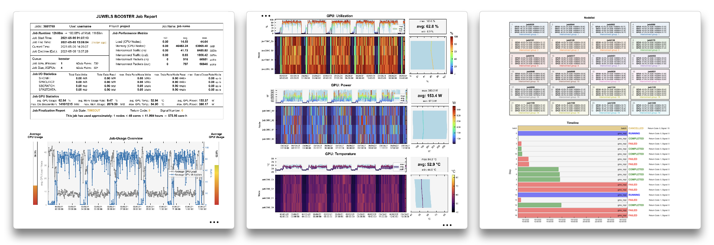

---
hide:
  - toc
---
# Detailed Reports

<figure markdown>
  { width="800" }
  <figcaption>Example of metrics and graphs in PDF report</figcaption>
</figure>

Each detailed report is organised into the following sections:

- **[Overview Table](overview_table.md)**  
  A concise snapshot of job metadata, timing, resources, performance summaries, I/O stats, GPU metrics, and final status.
- **[Usage Overview Graph](overview_graph.md)**  
  Time-series trends and overall averages for CPU and GPU utilisation.
- **[Metric Graphs](metric_graphs.md)**  
  Interactive heatmaps of individual metrics over time or across resources. For a complete list of metrics, see the [List of metrics](metrics_list.md). For additional graph examples, visit [Examples](examples.md).
- **[Node List](nodelist.md)**  
  Allocated nodes coloured by interconnect group, with GPU details and error highlights.
- **[Timeline](timeline.md)**  
  Chronological bars showing job and step durations coloured by state (interactive details on hover and click).
- **[System Errors](system_errors.md)**  
  Infrastructure-level errors detected during the run (this section appears only when system errors occur).

!!! tip
    The job reports accept options using the Slurm `--comment` field. Currently, the option below is available:

    - `llview_plot_lines`: In the PDF report, use line plots for each node/GPU instead of colorplots (recommended for jobs on fewer than 16 nodes or GPUs).

<figure markdown>
  { width="800" }
  <figcaption>Example of interactive graphs in detailed reports</figcaption>
</figure>

!!! info
    In the web-based report (accessible via the :fontawesome-solid-chart-area: link):

    * **Hover** over data points to see exact values.  
    * **Click-and-drag** or **pan** to zoom and shift axes.  
    * **Zoom-lock** toggle on the info bar (at the bottom) to synchronise axis ranges across sections.  
    * **Download** graph data as JSON using the button in the top-right corner of each chart.

