# Examples

Here we list examples on some cases where the reports generated by LLview 
were used to identify behaviours or to solve issues either on the system, on the program, or on the job configuration.

## High CPU Load with low CPU usage

A job usually tries to use all cores on the HPC system by generating a load that is compatible to the available cores (in case other resources - such as available memory - are not a restriction). 
However, if the configuration or the pinning is not done correctly, if can happen that the load generated by the user program is not distributed correctly among the available cores on the compute node.

This can be seen in the list of jobs of LLview by checking the columns CPU Load and CPU Usage:
<figure markdown>
  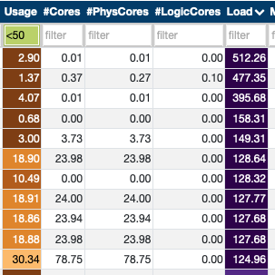{ width="300" }
  <figcaption>Example of jobs with high CPU Load but low CPU usage</figcaption>
</figure>
Although this can happen show up for jobs that are just running for a couple of minutes, it may indicate that something is wrong on jobs that are running for a longer time.

A job that was running with a CPU load close to 256 (the number of possible threads on the compute nodes) but only 50% of CPU usage presented the following distribution per core:
<figure markdown>
  { width="800" }
  <figcaption>Example of average core distribution of a job no using all the cores</figcaption>
</figure>
Even though the number of processes/threads included eventual simultaneous multithreading (SMT) usage, the graph indicates that no logical cores were used. Not only that, but even some of the "physical cores" were also not being used.

On the HTML report, the distribution of core usage per node was indicated in the following graph:
<figure markdown>
  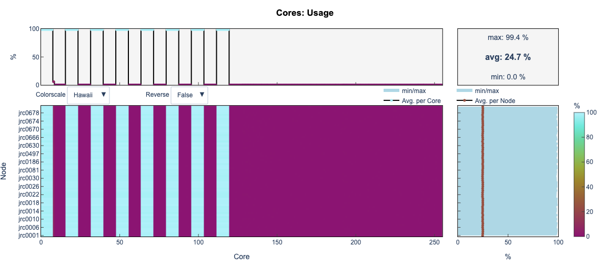{ width="800" }
  <figcaption>Example of core distribution per node of a job not using all the cores</figcaption>
</figure>
As it can also be seen from this colorplot, not only the "Logical" cores (the second half of the cores) were not used, neither some of the "Physical" (the first half) cores.

The problem in this case was a change on the Slurm configuration that was not passing the variable `cpus-per-task` to the `srun` commands. After fixing this issue, the CPU usage went up to close to 200%, as expected.

## Memory leak

A common case of errors is when the job runs out of memory.
This can be identified via the system report error mentioning `oom-killer`.
In this case, LLview detailed reports also display the message `(Out-of-memory)` on the initial header summary.

The cause of the memory overload can be simply a regular increase of a system size, a misconfiguration, 
but also it can originate on a *memory leak*.
This means that the program is constantly allocating more and more memory without freeing it up,
even though some variables/matrices are not used anymore.

<figure markdown>
  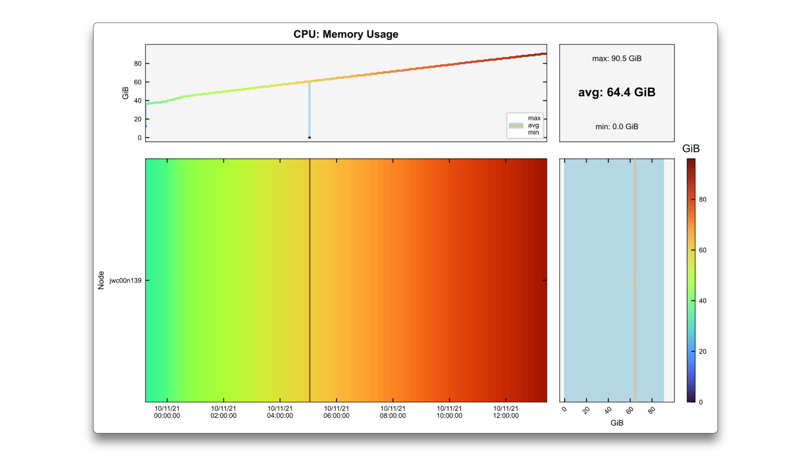{ width="800" }
  <figcaption>Example of possible memory leak</figcaption>
</figure>

The example above is a typical case where the memory usage increases constantly until it reaches the 
maximum amount available on the node (in this case, around `85 GiB`). This may be the correct behaviour
of the code, if it needs to keep storing more and more information as it is produced, but it may worth a
check if there is something that may be deallocated or even some other algorithm.

!!! note

    In LLview job reports, the `memory usage` graphs (both for CPU and GPU) is scaled by default from 0 up to the memory limit of the device. In the interactive graphs, these limits can be changed for the job limits.

<figure markdown>
  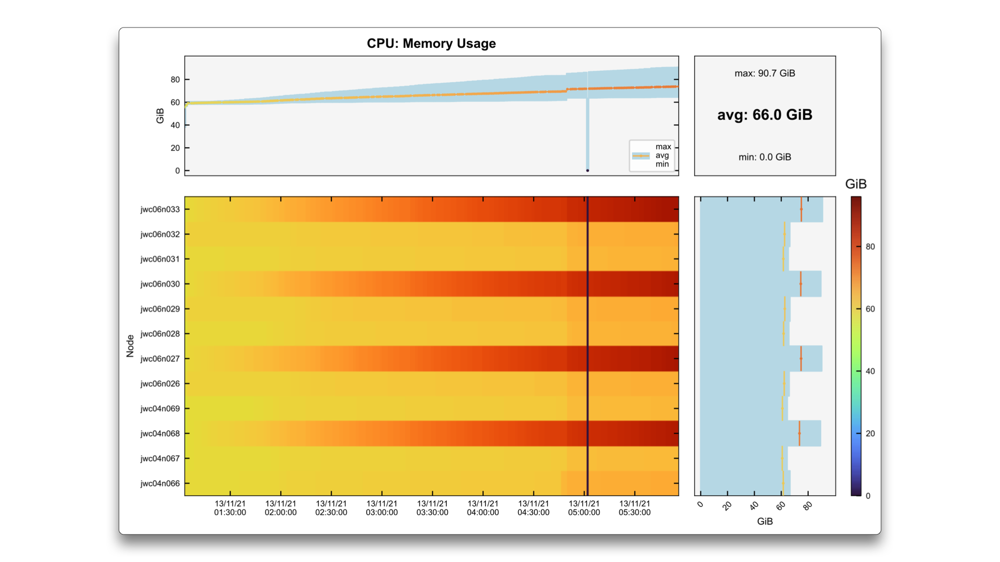{ width="800" }
  <figcaption>Example of possible memory leak every third node</figcaption>
</figure>

In this second scenario, the job uses 12 nodes, and only every third node display a monotonic memory increase.
In the top graph, which is the node-averaged memory usage per time, the average line may not be too high,
but the maximum reaches the limit of the system, and the program crashes.
As before, this can be a case of unfreed memory on those particular nodes.

<figure markdown>
  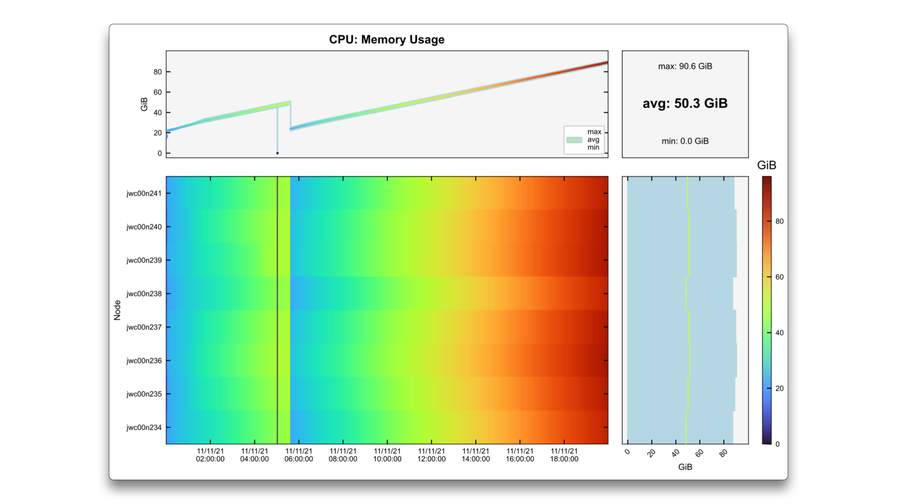{ width="800" }
  <figcaption>Example of possible memory leak in the second part of the run</figcaption>
</figure>

This third case shows an example of a job that consists of two parts. At the end of the first one, some memory is
freed, and the memory usage decreases. However, in the second part it increases again, reaching the limit of the system.

## Unused GPUs

The supercomputers usually have a number of GPUs in each node (at JSC, there are 4 GPUs per node). 
Their usage may be requested via the SBATCH argument `--gres=gpu:X` of Slurm, 
and then they must be correctly used by the code.
Another common scenario is that the code requests a given amount of nodes, but does not use
all the GPUs that are available.

<figure markdown>
  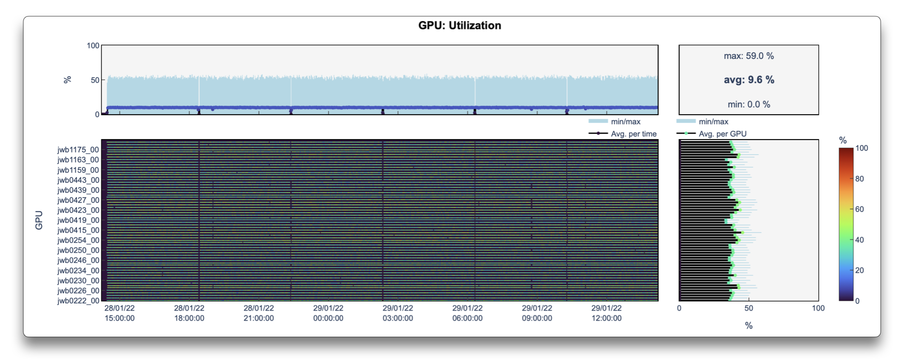{ width="800" }
  <figcaption>Example of unused GPUs</figcaption>
</figure>

This can be clearly seen in the GPU Utilization graph shown above, where the code is using 
only 1 GPU per node, and therefore taking longer to finish running and wasting 
computing time (as the job could have run in 4 times less nodes).

<figure markdown>
  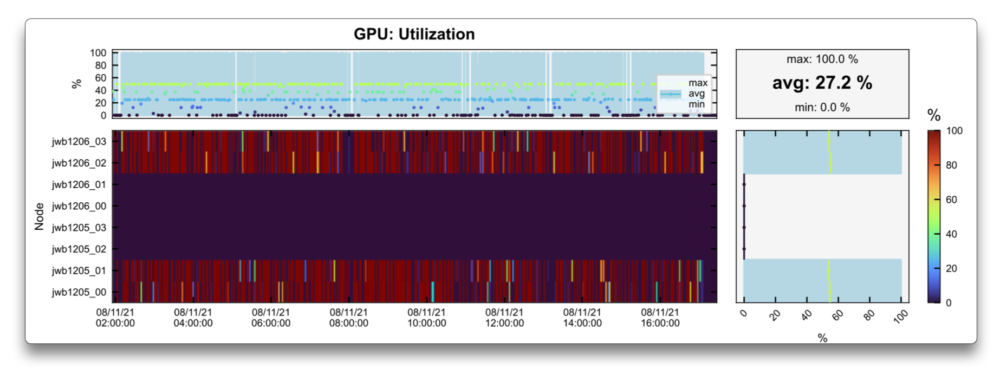{ width="800" }
  <figcaption>Example of unused GPUs</figcaption>
</figure>

Another example of unused GPUs is shown in a smaller job above.
In this case, 2 nodes were requested, but only the first two GPU of the first node and last two GPU of 
the second node were being used-while 4 GPUs were budy, another 4 were idle.
After the error has been identified via its job report on LLview, the user was informed and fixed the issue.

<figure markdown>
  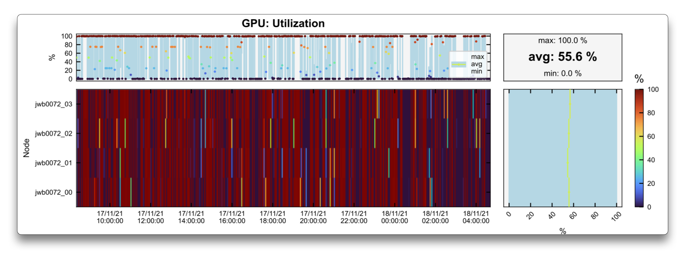{ width="800" }
  <figcaption>Example of all GPUs being used</figcaption>
</figure>

The new reports confirm that the new job use a single node, with all the GPUs being utilized.

## High Temperature / GPU Throttling

GPUs are expected to work on a given frequency.  
However, it may happen that due to different reasons, the working frequency is decreased-which is called throttling.
The most recurring cause of throttling is when the GPU operates at a high temperature (which by itself can also have different causes).

<figure markdown>
  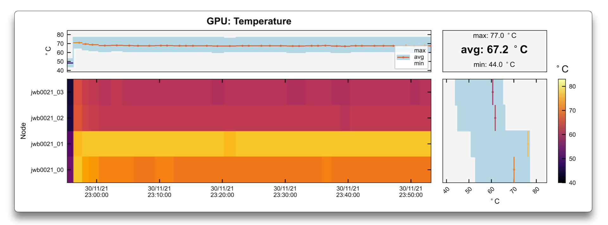{ width="800" }
  <figcaption>Example of high temperature in a single GPU</figcaption>
</figure>

<figure markdown>
  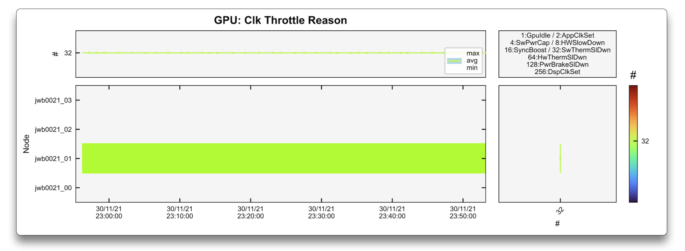{ width="800" }
  <figcaption>Example of Clock Throttle due to high temperature in a single GPU</figcaption>
</figure>

<figure markdown>
  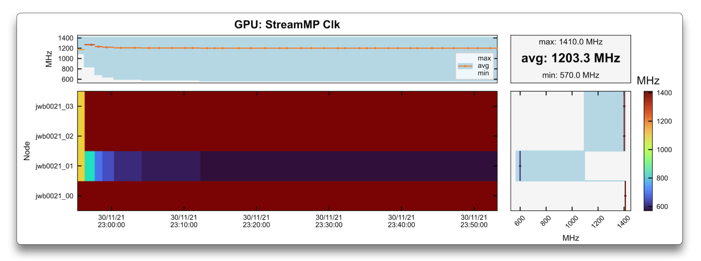{ width="800" }
  <figcaption>Example of lower frequency due to high temperature in a single GPU</figcaption>
</figure>

The graphs above show how this issue can be identified.
In this case, a single node job used 4 GPUs, and one of them had much slower frequency (as seen in the `StreamMP Clk` plot) than the others.
The cause of this speed down can be identified in the `Clock Throttle Reason` graph as being `32:SwThermSlDwn` (Software Thermal Slowdown).
Finally, the temperature of that given GPU was `77°C`, which was not large enough to trigger error signals to the administrators, 
but after being warned by the user, the referred node was put in maintenance to be fixed.

<figure markdown>
  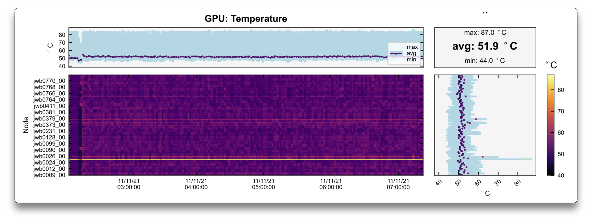{ width="800" }
  <figcaption>Example of high temperature in a single GPU</figcaption>
</figure>

<figure markdown>
  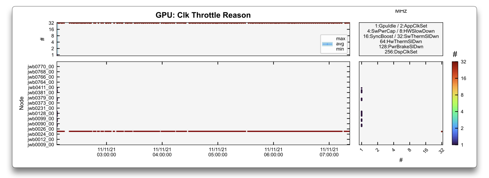{ width="800" }
  <figcaption>Example of Clock Throttle due to high temperature in a single GPU</figcaption>
</figure>

<figure markdown>
  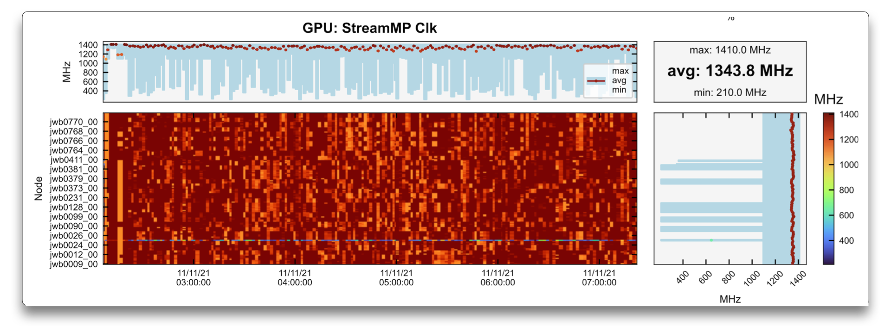{ width="800" }
  <figcaption>Example of lower frequency due to high temperature in a single GPU</figcaption>
</figure>

In this second example, it is more obvious that a single GPU in a very large job is much hotter than the others.
This also causes a clock throttle (i.e., a frequency decrease) of that given GPU in the `StreamMP Clk` due 
to `32:SwThermSlDwn` (Software Thermal Slowdown).
The node containing this GPU was drained and repaired.

## GPUs used with low occupation

When you first inspect GPU performance, you might check [`GPU Utilization`](metrics_list.md#gpu). 
This shows the percentage of time—over the last sampling interval—during which any kernel was running on the GPU. 
But beware: a single, simple kernel running constantly will report 100 % Utilization, even if it only uses a tiny slice of the GPU's actual compute resources.

A more telling metric for real parallelism is [`GPU Active SM`](metrics_list.md#gpu). 
This measures the average fraction of time that at least one warp was active on each Streaming Multiprocessor (SM), then averages across all SMs. 
(For reference, an NVIDIA A100 has 108 SMs, and an H100 may have up to 132 SMs.)

<figure markdown> 
  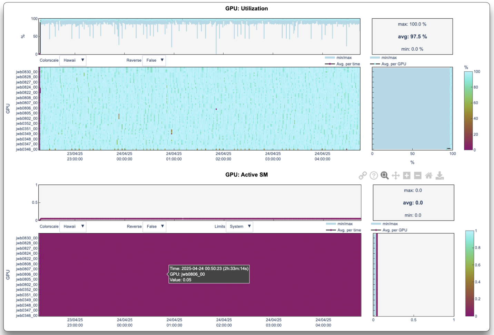{ width="800" } 
  <figcaption>Example: GPU Utilization = 100 %, but SM occupancy is very low</figcaption> 
</figure>

In the chart above, the job drives the GPU continuously (so Utilization reads 100 %) yet SM occupancy remains low. 
That gap means many SMs sit idle—if you launch more work or larger kernels, you can improve occupancy and make your code run significantly faster.

## Load imbalance

Another example where the LLview job reports may be of use is to verify poor performance of the code.
This can have origins on a wrong setup (as shown in [Unused GPUs](#unused-gpus)) or system problems (due to e.g., [High Temperature / GPU Throttling](#high-temperature-gpu-throttling)).
However, it can also happen due to load imbalance in the code, that is, when some nodes have to do more work than others.

<figure markdown>
  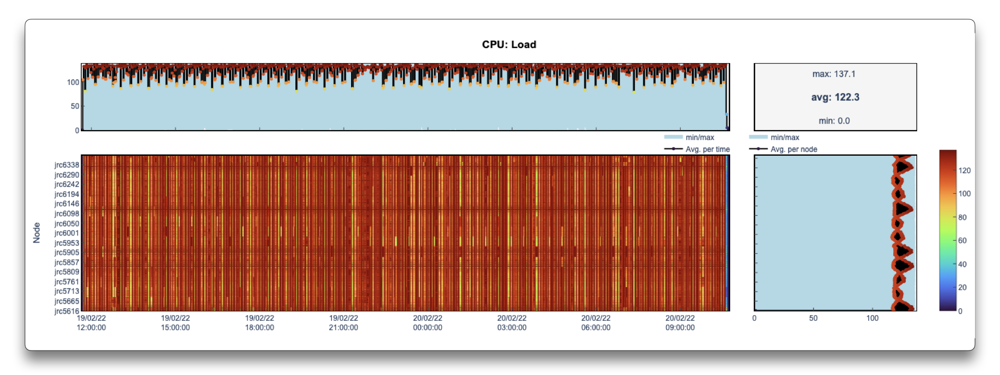{ width="800" }
  <figcaption>Example of load imbalance on the nodes</figcaption>
</figure>

In the case above, this is reflected on a CPU load that varies between the nodes.

!!! note

    In LLview job reports, the `CPU Load` is obtained from Slurm, which at JSC contains the 1-min load average.

<figure markdown>
  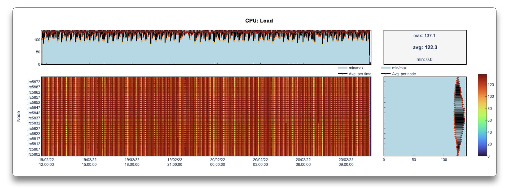{ width="800" }
  <figcaption>Example of load imbalance on the nodes (zoom)</figcaption>
</figure>

When zooming a particular region (which can be done in the detailed reports generated by LLview), the pattern becomes more clear.
In this case, the origin was a bad choice of distribution scheduling in OpenMP.

## CPU-GPU load alternation

Besides helping to identify errors or erroneous configurations, the reports may also help to recognize patterns on the jobs.

<figure markdown>
  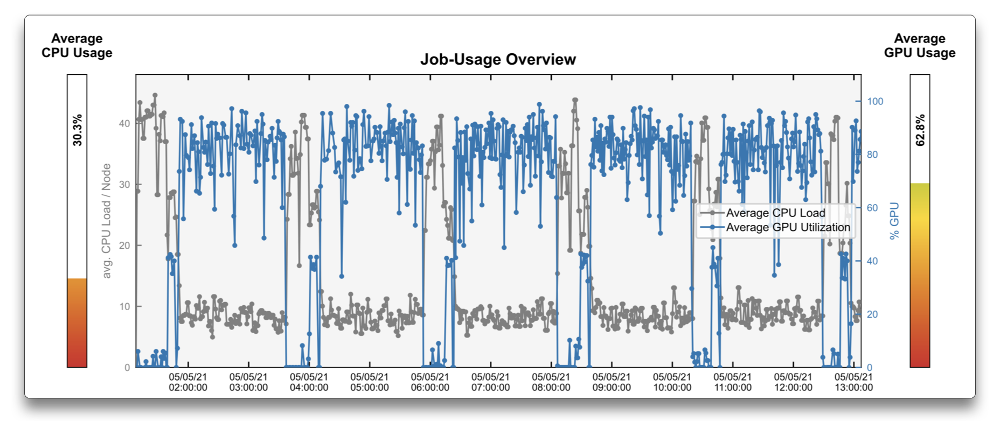{ width="800" }
  <figcaption>Job work alternating between CPU and GPU</figcaption>
</figure>

The overview of the job above shows how the workload alternates between CPU and GPU, and where the time is mostly spent.
This information can be used to focus performance improvements either on the most time-consuming part or on overlapping calculations, if possible.

## Others

<figure markdown>
  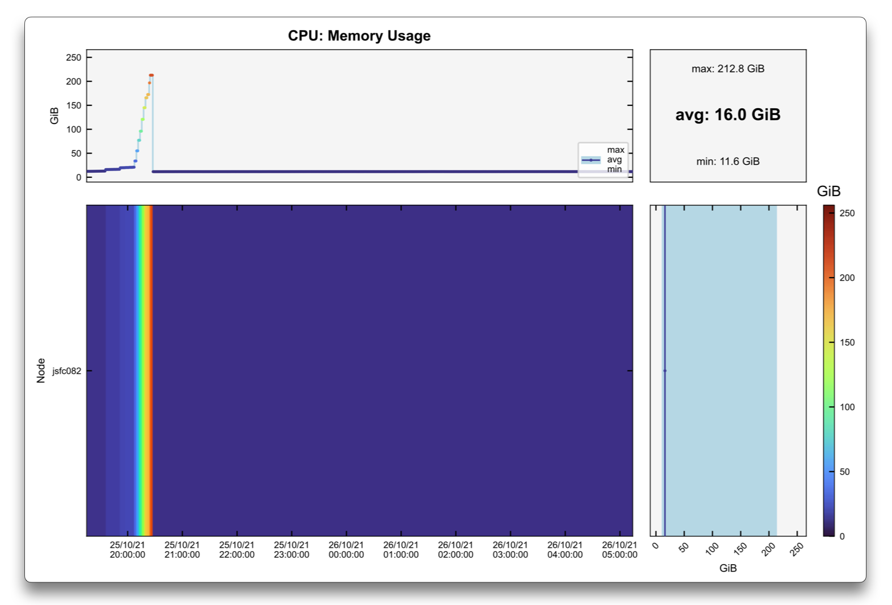{ width="800" }
  <figcaption>Beautiful day</figcaption>
</figure>

This just looks like a rainbow in a blue sky. If you have a nice graph [send to us too](../contact/index.md)!

Have a nice day!
