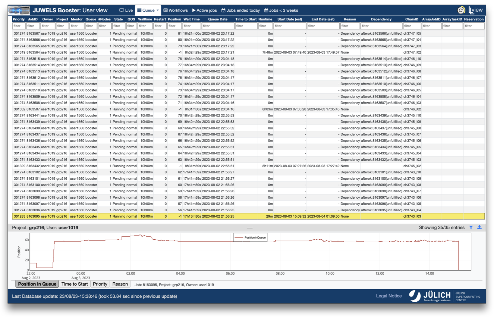

---
hide:
  - navigation
---
# Queue

<figure markdown>
  { width="800" }
  <figcaption>Queue Details (User Jobs) in User View</figcaption>
</figure>

LLview web portal also displays a view on the current queue list of the system via two pages in the `Queue` tab.

## Queue Overview

This page contains the queued, running and recently finished jobs for all the users. The metrics displayed in the table includes:

* **JobID**: Slurm Job ID;
* **Owner**: Username of the user owner of the job;
* **Project**: Budget used for job submission (project ID);
* **Mentor**: Mentor of the project;
* **Queue**: Partition used for the job;
* **\#Nodes**: Number of nodes used by the job;
* **State**: State of the job (pending, running, failed or completed);
* **Walltime**: Requested walltime;
* **Queue Date**: Date and time the job entered the queue;
* **Runtime**: Overall runtime (for running jobs);
* **Start Date (est)**: Date and time the job started (or estimate);
* **Est. End Date**: Estimated end date of the job (Start Date + requested Walltime);
* **ArrayJobID**: The JobID of the first element of the job array (Slurm);
* **ArrayTaskID**: Array index of this particular entry, either a single number of an expression identifying the entries represented by this job record (e.g. "5-1024") (Slurm);
* **Reservation**: Reservation used by the job.

## Queue Details (User Jobs)

The detailed queue only shows jobs for the current user/project (depending on the current view).
It includes extra metrics for each job that are not seen by other users/projects.
The additional information available are:

* **Priority**: Current priority of the job (the higher, the more probable a job will get scheduled if it fits in the queue);
* **QOS**: Quality of service, i.e., if the project still has quota (`normal`), already used the monthly quota (`lowcont`) or used the total quota (`nocont`);

!!! note

    At JSC, `lowcont` and `nocont` give different priorities to the job. Nevertheless, jobs with those status can still run when there are idle nodes.

* **Restart**: Number of restart cycles during the preparation of the nodes;
* **Position**: Current position of the job in the queue;
* **Wait Time**: How long the job waited in the queue;
* **Time to Start**: Estimated remaining waiting time for the job to start;
* **Reason**: Reason the job could not be scheduled yet;
* **Dependency**: Slurm job dependencies;
* **ChainID**: ID of the job chain, computed from dependency information (for job with dependencies only).

This view also allows a selection of a job in the table to view footer graphs containing the progress of some metrics with time. 
The available graphs are:

* Position in the Queue
* Time to Start
* Priority
* Reason